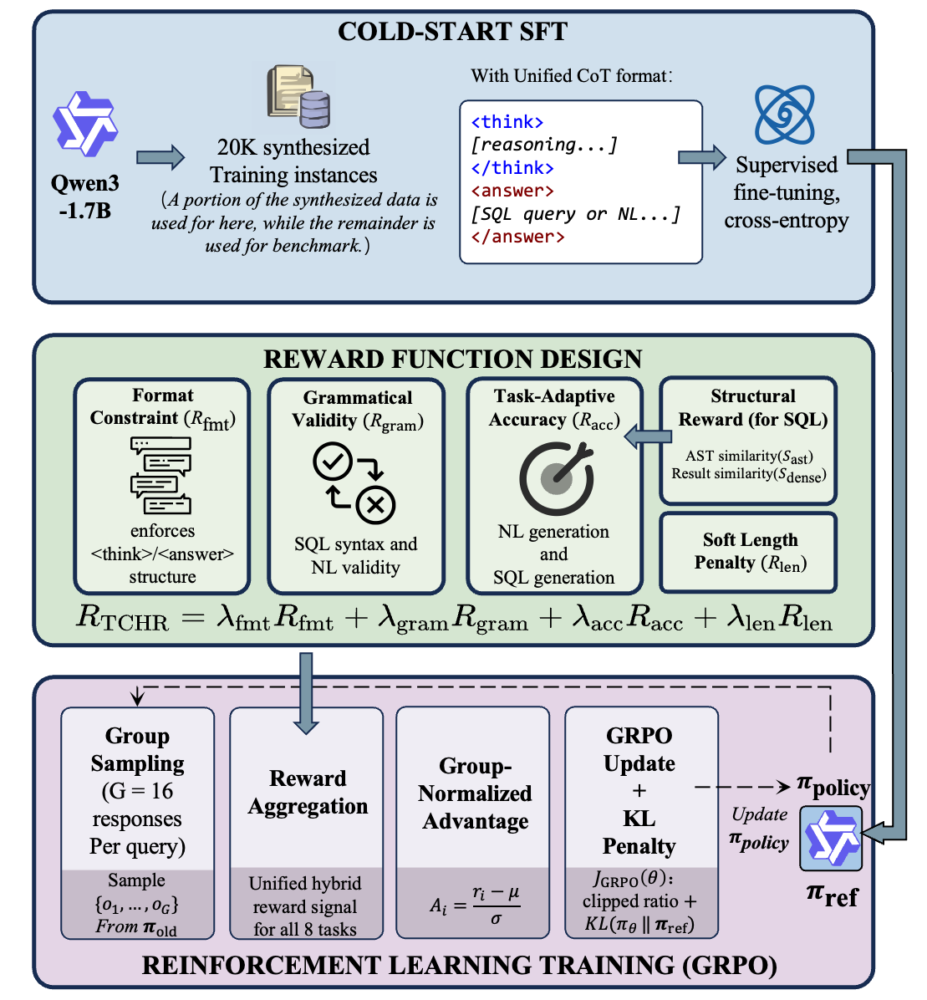
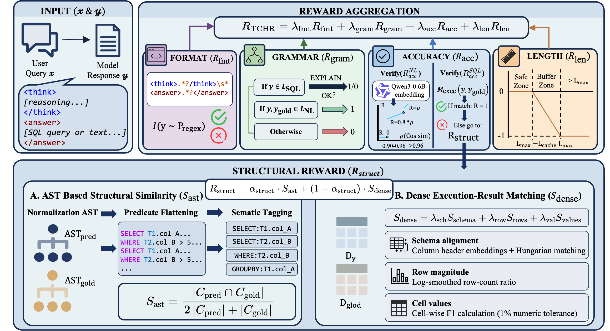
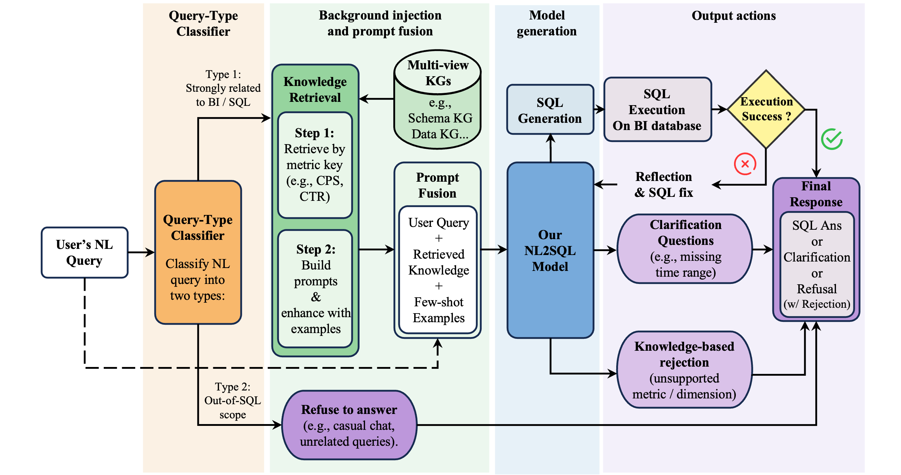

# BAR-SQL: Boundary-Aware Reliable NL2SQL

[](https://anonymous.4open.science/...)
[](LICENSE)

Official implementation of **"Boundary-Aware NL2SQL: Integrating Reliability through Hybrid Reward and Data Synthesis"** - A unified framework for enterprise-grade NL2SQL systems that achieves **91.48% average accuracy** while maintaining boundary-aware abstention capabilities.

## 🎯 Overview

BAR-SQL (Boundary-Aware Reliable NL2SQL) addresses critical reliability challenges in enterprise NL2SQL deployment:

- **Forced Answering Problem**: Existing models generate plausible but incorrect SQL for ambiguous/unanswerable queries instead of abstaining
- **Complex Business Logic**: Real-world enterprise databases require multi-step reasoning and deep business rule understanding
- **Data Scarcity**: Limited high-quality domain-specific training data hinders enterprise adoption

### Key Features

✅ **91.48% Average Accuracy** - Outperforms GPT-5 and Claude 4.5 Sonnet by 43%+

✅ **Boundary-Aware Abstention** - Knows when to refuse, clarify, or ask follow-up questions

✅ **Knowledge-Grounded Reasoning** - Explicit CoT traces anchored in schema metadata

✅ **Lightweight & Efficient** - Based on Qwen3-1.7B for on-premise deployment

✅ **Seed-Mutation Data Synthesis** - Scalable pipeline for enterprise-grade training data

---

## 📊 Architecture

BAR-SQL consists of three core components:

1. **Seed-Mutation Data Synthesis**: Automated generation of enterprise-grade training corpus
2. **Knowledge-Grounded Reasoning Synthesis (KGRS)**: Evidence-based CoT generation framework
3. **Task-Conditioned Hybrid Reward (TCHR)**: Unified reward mechanism for GRPO training

### Training Pipeline Overview

<div align="center">
  
  <p><i>Figure 1: Overview of the BAR-SQL training pipeline. The framework consists of three stages: cold-start SFT with unified CoT format, TCHR reward function design (integrating Format, Grammar, Accuracy, and Length components), and GRPO-based policy optimization.</i></p>
</div>

### Reward Function Design Overview
<div align="center">  <p><i>Figure 2: Overview of BAR-SQL reward function structure.</i></p> </div>

### Application in enterprise BI environment
<div align="center">  <p><i>Figure 3: The system comprises a query-type
classifier, knowledge retrieval module, and generation engine with optional reflection loop. This decoupled design enables
flexible maintenance and extension of business logic without model retraining..</i></p> </div>

### Supported Task Types (8 Categories)

| Category | Description | Output Type |
|----------|-------------|-------------|
| Standard SQL | Basic single-table/multi-table queries | SQL |
| Multi-Step Reasoning | Complex analytical queries with CTEs | SQL |
| Reflection | Self-correction from SQL execution errors | SQL |
| Degenerate Dimension | Adapted to denormalized schemas | SQL |
| Ambiguity Clarification | Request clarification for vague queries | Natural Language |
| Constraint Follow-Up | Ask for mandatory metric constraints | Natural Language |
| Dimension Rejection | Refuse queries with undefined dimensions | Natural Language |
| Metric Rejection | Refuse queries with undefined metrics | Natural Language |

---

## 🚀 Quick Start

### Requirements

```bash
Python >= 3.9
PyTorch >= 2.6.0
DeepSpeed >= 0.18.2
CUDA >= 12.4
transformers == 4.57.1
ms-swift == 3.9.3
```

### Installation

```bash
git clone https://github.com/your-org/BAR-SQL.git
cd BAR-SQL

# Install dependencies
pip install -r requirements.txt
pip install "deepspeed>=0.17.6"
pip install "trl>=0.23.1"
pip install transformers==4.57.1
pip install ms-swift==3.9.3
```

---

## 📁 Project Structure

```
BAR-SQL/
├── data_synthesis/               # Data synthesis pipeline
│   ├── clarify_data_syn.py      # Ambiguity clarification data
│   ├── continue_ask_data_syn_constraints.py  # Follow-up constraints
│   ├── index_reject_data_syn.py # Metric rejection data
│   ├── mutil_infer_data_syn.py  # Multi-step reasoning data
│   ├── reflection_data_sys.py    # Self-correction data
│   ├── prompt_txt.py             # All synthesis prompts
│   └── utils.py                  # Utility functions
│
├── model_training/               # Training scripts
│   ├── sft.sh                   # Supervised Fine-Tuning
│   ├── grpo_main.sh             # GRPO training (main)
│   ├── grpo_rollout.sh          # GRPO rollout generation
│   └── plugin_open_source.py    # Custom reward plugins
│
├── model_test/                   # Evaluation scripts
│   ├── trained_model_infer.py   # Model inference
│   ├── closed_model_infer.py    # Baseline models (GPT/Claude)
│   ├── main_eval.py             # Main evaluation loop
│   ├── taming_sql.py            # SQL normalization
│   └── utils.py                 # Evaluation utilities
│
├── benchmark/                    # Evaluation benchmark
│   └── Ent-SQL-Bench.json       # Held-out test dataset (1,262 instances)
│
├── assets/                       # Documentation assets
│   ├── Application.pdf          # Application architecture diagram
│   ├── ModelTrain.pdf           # Training pipeline illustration
│   ├── RewardFunction.pdf       # TCHR reward function design
│   └── seedGeneration.pdf       # Seed-Mutation data synthesis workflow
│
└── README.md
```

---

## 🔧 Training Pipeline

### Step 1: Data Synthesis

Generate training data using the Seed-Mutation paradigm:

```bash
cd data_synthesis

# 1. Generate seed data (requires your schema + knowledge graph)
python seed_generation.py \
  --schema_path="path/to/schema.json" \
  --metric_kg="path/to/metrics.json" \
  --domain_rules="path/to/rules.json" \
  --output_dir="./seed_data"

# 2. Generate mutation data for each task type
python mutil_infer_data_syn.py --task_type="multi_step"
python reflection_data_sys.py --task_type="reflection"
python clarify_data_syn.py --task_type="ambiguity"
# ... (repeat for other task types)
```

**Output**: `~20K training instances` across 8 task categories with KGRS-generated CoT traces.

### Step 2: Supervised Fine-Tuning (Cold Start)

```bash
cd model_training

# Configure distributed training
export NNODES=6              # Number of nodes
export NODE_RANK=0           # Current node rank
export MASTER_ADDR="<master_ip>"
export MASTER_PORT="<master_port>"
export NPROC_PER_NODE=8      # GPUs per node

# Launch SFT training
bash sft.sh
```

**Key Parameters** (in `sft.sh`):
- `model_type`: qwen3
- `sft_type`: full (full-parameter fine-tuning)
- `batch_size`: 2 per device
- `epochs`: 5
- `learning_rate`: 5e-5
- `max_length`: 4096
- `deepspeed`: zero2

**Expected Runtime**: ~40 hours on (8+48)x A100 GPUs

### Step 3: GRPO Alignment

```bash
# Terminal 1: Start vLLM rollout server (8 GPUs)
bash grpo_rollout.sh

# Terminal 2: Launch GRPO training (48 GPUs)
bash grpo_main.sh
```

**TCHR Reward Components**:
- `λ_acc = 1.5`: Execution accuracy / semantic similarity
- `λ_fmt = 1.0`: Output format constraint (`<think>...</think><answer>...</answer>`)
- `λ_gram = 0.9`: SQL syntax validity
- `λ_len = 0.8`: Overlong penalty
- `α_struct = 0.5`: AST similarity vs. dense result matching

**GRPO Hyperparameters**:
- `group_size`: 16
- `learning_rate`: 1e-6
- `temperature`: 1.0
- `kl_coeff`: 0.01

**Expected Runtime**: ~24 hours on 48x A800 GPUs + 8x A800 (rollout)

---

## 📈 Evaluation

### Ent-SQL-Bench

We provide a specialized benchmark (`Ent-SQL-Bench`) with 1,218 held-out instances:

| Metric | Description |
|--------|-------------|
| **Execution Accuracy (Acc_exec)** | Exact result set match for SQL tasks |
| **Semantic Consistency (Acc_sem)** | GPT-4o-as-Judge for NL tasks (3 votes) |

### Run Evaluation

```bash
cd model_test

python main_eval.py \
  --model_path="path/to/checkpoint" \
  --test_data="../benchmark/Ent-SQL-Bench.json" \
  --output_dir="./eval_results"
```

### Baseline Comparison

Performance comparison across SQL generation tasks and boundary interaction tasks on **Ent-SQL-Bench** (1,218 test instances):

| Model | Dim. Deg. | Reflection | Std. SQL | Multi-Step | Ambiguity | Dim. Rej. | Metric Rej. | Follow-Up | **Avg.** |
|-------|-----------|------------|----------|------------|-----------|-----------|-------------|-----------|----------|
| **General-Purpose Baselines** | | | | | | | | | |
| Claude-4.5-Sonnet | 44.07% | 69.79% | 60.56% | 69.72% | 16.13% | 18.64% | 87.50% | 17.75% | 48.02% |
| Gemini3-Pro | 49.15% | 64.52% | 52.69% | 62.50% | 0.00% | 0.00% | 10.34% | 0.00% | 29.90% |
| GPT-4o | 40.68% | 28.13% | 22.54% | 17.96% | 2.15% | 0.00% | 34.38% | 2.90% | 18.59% |
| GPT-5 | 35.59% | 80.21% | 46.48% | 67.61% | 5.56% | 13.79% | 70.49% | 48.24% | 46.01% |
| DeepSeek-V3.2 | 42.37% | 82.29% | 47.89% | 41.90% | 0.00% | 1.69% | 17.19% | 0.00% | 29.17% |
| **Ours** | | | | | | | | | |
| Qwen3-1.7B (Base) | 10.17% | 38.54% | 14.08% | 4.93% | 0.00% | 0.00% | 0.00% | 0.00% | 8.47% |
| Qwen3-1.7B (SFT) | 77.97% | 83.33% | 62.32% | 63.73% | 68.75% | 42.37% | 86.12% | 55.80% | 67.55% |
| **BAR-SQL (Ours)** | **93.22%** | **93.75%** | **90.75%** | **81.69%** | **94.51%** | **93.31%** | **92.27%** | **92.36%** | **91.48%** |

**Task Abbreviations**:
- **Dim. Deg.**: Degenerate Dimension (denormalized schemas)
- **Std. SQL**: Standard SQL generation
- **Dim. Rej.**: Dimension Rejection (undefined dimensions)
- **Metric Rej.**: Metric Rejection (undefined metrics)

**Key Observations**:
- **Hallucination Problem**: General-purpose LLMs (GPT-5, Claude, Gemini) achieve 60-80% on SQL tasks but collapse on boundary tasks (0-20%), indicating severe forced answering
- **SFT Impact**: Supervised fine-tuning dramatically improves boundary awareness (0% → 63% average) while maintaining SQL generation quality
- **GRPO Breakthrough**: Reinforcement learning with TCHR provides the decisive leap (67.55% → 91.48%), especially on rejection tasks (42.37% → 93.31% for Dim. Rej.)

---


<!-- ## 📄 Citation

If you find BAR-SQL useful for your research, please cite:

```bibtex
@inproceedings{tian2025barsql,
  title={Boundary-Aware NL2SQL: Integrating Reliability through Hybrid Reward and Data Synthesis},
  author={Tian, Songsong and Zhuo, Kongsheng and Wang, Zhendong and Shen, Rong and Zhang, Shengtao and Wu, Yong},
  booktitle={Proceedings of ACM SIGMOD/PODS Conference},
  year={2025},
  organization={ACM}
}
``` -->

---

## 📜 License

This project is licensed under the MIT License - see the [LICENSE](LICENSE) file for details.

---

## 🙏 Acknowledgments

- **Base Model**: [Qwen3 by Alibaba Cloud](https://github.com/QwenLM/Qwen3)
- **Training Framework**: [ms-swift by ModelScope](https://github.com/modelscope/swift)
- **Inspiration**: Spider 2.0, BIRD, DeepSeek-R1 for reasoning paradigms

---

**Status**: 🚀 Actively maintained | Last updated: January 2025
